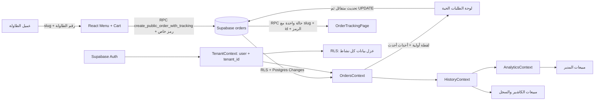

# دليل SERVIO التقني — فهم النسخة الأولى والاستعداد للنسخة الثانية

> هذا الدليل يشرح التطبيق كما هو في المستودع، لا كتصميم نظري فقط. أُضيفت تعليقات عربية مفصلة إلى مسارات الطلبات، وتهيئة المستأجر، والسجل والتحليلات. بقية المكونات مشروحة هنا بدل وضع تعليق على كل سطر؛ لأن التعليق الحرفي على كل سطر يزيد الضوضاء ويصعّب الصيانة.

## 1. SERVIO في جملة

SERVIO تطبيق ويب لإدارة طلبات الطاولات للمقاهي والمطاعم: يفتح العميل المنيو من رابط أو QR، يرسل الطلب، ثم يراه الكاشير/المدير ويحدّث حالته؛ وبعد اكتماله يدخل في سجل المبيعات والتحليلات.

**تقنيات النسخة الحالية:** React 19 وMaterial UI، Supabase Auth/Postgres/Realtime، وVercel لنشر واجهة الويب. الواجهة ثنائية اللغة في أغلب لوحات الإدارة وتدعم RTL عند العربية.

## 2. صورة ذهنية لتدفق البيانات



**قاعدة الاعتماد الأساسية:** لا تبدأ قراءة الطلبات قبل معرفة `tenant_id`. لذلك يأتي `TenantProvider` قبل `OrdersProvider`، ثم يأتي `HistoryProvider` و`AnalyticsProvider` بعدهما.

## 3. ترتيب مزودي الحالة ولماذا يهم

في `src/index.js` توضع مزودات React حول التطبيق. الترتيب ليس تجميليًا:

1. `LanguageProvider`: النصوص والاتجاه RTL/LTR.
2. `TenantProvider`: يحسم هل الصفحة عامة أم لوحة داخلية، ويعيد `tenantId` وملف النشاط.
3. `MenuProvider` و`CartProvider`: قائمة الطعام والسلة.
4. `OrdersProvider`: الطلبات، استعلام Supabase، قناة Realtime، الإضافة وتغيير الحالة.
5. `HistoryProvider`: يفصل الطلبات المكتملة والملغاة ويشارك حالة التحميل والخطأ.
6. `AnalyticsProvider`: يبني الأرقام والرسوم من بيانات السجل.
7. بقية المزودات: المتجر والمستخدم والطاولات والتقييمات ونداءات النادل والاقتراحات.

أي استدعاء لـ`useOrders()` داخل مزود يجب أن يكون داخل هذا الترتيب، وأي قراءة للوحة المدير لا يجوز أن تتجاوز حالة تحميل المستأجر.

## 4. خريطة الملفات الأساسية

| الملف/المجلد | المسؤولية | ما ينبغي فهمه قبل التعديل |
|---|---|---|
| `src/App.js` | تعريف المسارات العامة ولوحات الأدوار | `/menu/:slug/:tableNumber?` و`/:slug/:tableNumber?` للمنيو؛ `/track/:slug/:orderId` لتتبع عميل؛ `/dashboard` للكاشير؛ `/manager` للمدير. |
| `src/context/TenantContext.jsx` | حل slug العام أو جلسة المستخدم والملف والمستأجر | `tenantId` هو شرط قراءة البيانات وسياسات RLS. |
| `src/context/UserContext.jsx` | تجهيز هوية العرض من Supabase Auth وملف المستخدم | Auth يثبت الهوية؛ بيانات `profiles` توفر الدور والاسم. |
| `src/supabase.js` | إنشاء عميل Supabase وإعداد الاتصال | مفاتيح المتصفح لا تتضمن مطلقًا `service_role`. |
| `src/context/MenuContext.jsx` | تحميل الأصناف والفئات وتعديلها | RPCs عامة للمنيو، واستعلامات مقيدة بـ`tenant_id` في الإدارة. |
| `src/context/CartContext.jsx` | حفظ السلة المحلية قبل الإرسال | لا تجعل السلة مصدر إجمالي مبيعات موثوقًا؛ قاعدة البيانات هي المرجع بعد إنشاء الطلب. |
| `src/context/OrdersContext.jsx` | المصدر الأساسي للطلبات والـRealtime والإضافة وتغيير الحالة | اقرأ تعليقاته العربية؛ فيه مزامنة اللقطة الأولية مع التغييرات اللحظية والتراجع الآمن عن التحديث المتفائل. |
| `src/pages/OrderTrackingPage.jsx` | صفحة عامة لتتبع حالة طلب واحد | تستخدم RPC برمز سري ولا تقرأ جدول الطلبات مباشرة؛ توقف التحديث بعد انتهاء الحالة. |
| `src/context/HistoryContext.jsx` | تصنيف سجل المكتمل/الملغى ونقل حالة التحميل | لا ينشئ استعلامًا موازيًا؛ يعيد استخدام `OrdersContext`. |
| `src/context/AnalyticsContext.jsx` | حساب مبيعات اليوم/الأسبوع/الساعات ومتوسط الطلب والأصناف | يحتسب الطلبات المكتملة غير الملغاة؛ الرسم اليومي يجمع 24 ساعة من `00:00` إلى `23:00` باستخدام `completed_at` مع رجوع للقديم. |
| `src/pages/CashierDashboard.jsx` | إجمالي اليوم وسجل الكاشير وقائمة الطلبات | يعرض شرطة عند عدم اكتمال التحميل كي لا يحوّل الخطأ إلى صفر. |
| `src/components/cashier-dashboard/orders/LiveOrders.jsx` | أعمدة الطلبات النشطة | البطاقة لا تعرض طلبًا ناقص الحقول؛ الرسالة توفر إعادة محاولة عند فشل القراءة. |
| `src/components/cashier-dashboard/orders/OrderItemCard.jsx` | عرض الطلب وزر انتقال الحالة والفاتورة | الواجهة تعرض تحديثًا متفائلًا؛ `OrdersContext` يؤكد الحفظ من قاعدة البيانات. |
| `src/components/manager-dashboard/Analytics/AnalyticsOverview.jsx` | بطاقات إجمالي اليوم ومتوسط الطلب والنمو | يستخدم `analyticsReady`، فلا يعرض أصفارًا أثناء التحميل أو الخطأ. |
| `src/components/manager-dashboard/orders/OrderPill.jsx` | الفاتورة القابلة للطباعة | تحتاج من كل صنف الاسم والكمية والسعر؛ لا تحتاج صورة المنيو. |
| `supabase/migrations/` | تطور مخطط قاعدة البيانات وسياساتها ودوالها | لا تعدّل ترحيلًا مطبقًا؛ أضف ترحيلًا جديدًا واحفظ ترتيب الإصدارات. |
| `public/index.html`, `public/manifest.json` | اسم الصفحة وأيقونة المتصفح وبيانات PWA | حافظ على اتساق الاسم واللون مع علامة SERVIO. |

## 5. مسارات الاستخدام خطوة بخطوة

### 5.1 طلب العميل من QR

1. رابط QR يفتح `/:slug/:tableNumber` (أو مسار `/menu/...`).
2. `TenantContext` يرى وجود `slug`، ثم يطلب `get_public_tenant` و`get_public_store`.
3. `MenuContext` يقرأ الفئات والأصناف عبر RPCs عامة مسموح بها للمنيو.
4. `CartContext` يجمع الأصناف والإضافات محليًا.
5. `OrdersContext.addOrder()` يختصر عناصر الطلب إلى `id`, `cartItemId`, `name`, `quantity`, `price`، ثم ينادي `create_public_order_with_tracking` مع slug الطاولة والإجمالي والملاحظات.
6. قاعدة البيانات تضع `tenant_id` من slug موثوق، وتخزن بصمة SHA-256 لرمز عشوائي لا يملكه إلا صاحب هذا التدفق. كما يفرض trigger إزالة حقول الصور والوصف من `items` عند الإدراج أو التحديث.
7. بعد حفظ الطلب، يخزن `CartDrawer` الرمز في `sessionStorage` وينتقل إلى `/track/:slug/:orderId`؛ لا يظهر السر في الرابط. صفحة التتبع تستعلم حالة هذا الطلب فقط عبر RPC.
8. بالتوازي يصل الطلب إلى لوحة الفريق عبر Postgres Changes الخاصة بالمستأجر؛ تُضاف البطاقة ويُصدر صوت التنبيه مرة واحدة.

### 5.2 تحديث حالة الطلب

مسار الحالة في الواجهة:

```text
pending → preparing → ready → served
     └→ cancelled             └→ unclaimed
```

- `pending` و`preparing` و`ready` تظل في لوحة الطلبات النشطة.
- `served` و`unclaimed` حالات منتهية، وتدخل في المبيعات.
- `cancelled` يثبت في السجل لكنه لا يُحسب إيرادًا مكتملًا.
- عند الضغط، تعرض البطاقة الحالة الجديدة فورًا لتظل الواجهة سريعة، ثم تحفظ `status`, `is_completed`, `completed_at` في `orders`.
- إذا تعذر الاتصال مؤقتًا، تعاد المحاولة مرتين. عند فشل مؤكد ترجع الواجهة للحالة السابقة فقط إذا لم يصل حدث أحدث من جهاز آخر.
- وصول `UPDATE` عبر Realtime يوحّد الأجهزة المفتوحة على قاعدة البيانات؛ إجمالي المبيعات لا يعتمد على نجاح تحديث CSS أو حالة محلية.

### 5.3 حساب المبيعات

- `orders.total_price` هو قيمة الطلب المحفوظة عند الإنشاء، وهو مصدر جمع المبيعات.
- تستبعد `cancelled` دائمًا من إيراد المبيعات.
- يعتمد يوم البيع على `completed_at`، وعند غيابها في سجل قديم يستخدم `created_at`.
- متوسط الطلب = إجمالي مبيعات الطلبات المكتملة اليوم ÷ عددها.
- المنتجات الأعلى مبيعًا تُحسب من `name`, `quantity`, `price` في عناصر الطلب.
- تحميل البيانات أو فشله لا يعني مبيعات صفرًا: تعرض اللوحات `—`، ويعرض المدير/الكاشير إعادة محاولة حيث يلزم.

## 6. قواعد الأمان وSupabase للمطور

### 6.1 عزل الأنشطة

- كل صف خاص بنشاط يحمل `tenant_id`.
- المستخدم الداخلي يصل عبر جلسة Supabase، وRLS تفحص الملف/الدور/المستأجر في قاعدة البيانات.
- فلتر `.eq("tenant_id", tenantId)` في الواجهة يقلل النتائج ويحسن الوضوح، لكنه **ليس بديلًا** عن RLS.
- الـRPC العام مقصور على البيانات اللازمة للزائر ويأخذ `slug`، أما عمليات الإدارة فتتطلب الجلسة وسياسات الدور.

### 6.2 مفاتيح الاتصال

- يسمح في bundle المتصفح بمفتاح Supabase **anon/publishable** فقط لأن الحماية الفعلية هي RLS.
- لا تضع `service_role` أو مفاتيح Vercel السرية في React أو في مستودع Git.
- احتفظ بالقيم المحلية في `.env.local`؛ الملف مستثنى في `.gitignore`.
- في Vercel، عرّف متغيرات البيئة في إعدادات المشروع ثم أعد النشر؛ لا تسجل قيمها في وثيقة أو سجل CI.

### 6.3 مراجعة طلب جديد في Supabase

عند فشل قراءة أو كتابة:

1. افحص حالة جلسة المستخدم في `auth.users`/`supabase.auth.getSession()`، لا تطبع token.
2. تأكد أن `TenantContext.loading` انتهى وأن `tenantId` ليس `null`.
3. راجع RLS policies على الجدول والدور الحالي.
4. راجع أخطاء PostgREST وPostgres وRealtime، ثم قارن رقم الطلب ووقته دون مشاركة بيانات شخصية.
5. اختبر RPC من عميل غير مسجل ومستخدم من نشاط آخر؛ يجب ألا يرى أي طلب غير تابع له.

## 7. سبب المشاكل التي ظهرت وما عالجه هذا الإصدار

### 7.1 بطء وصول الطلب وفشل انتقال الحالة

في الإنتاج كانت **10 طلبات تحتوي على `image` كبيرة داخل كل عنصر**؛ حجم أكبر صف يقارب 1.51 MB، ومجموع عمود `items` قرابة 14 MB رغم وجود 31 طلبًا فقط. هذه الصور مكانها المنيو/التخزين، وليست داخل سجل الفاتورة. وكانت استعلامات قراءة الطلبات تسحب `items` كاملة، فتؤخر التهيئة وتضخم أحداث التحديث.

التنظيف السابق كان لمرة واحدة؛ لذلك أضاف بعض العملاء القدامى طلبات كبيرة بعده. المعالجة الجديدة من طبقتين:

1. **قبل الحفظ:** trigger في Postgres يزيل `image`, `tags`, `description`, `allergens` من عناصر كل `INSERT` و`UPDATE`، بما يشمل عملاء قدامى وRPC العام.
2. **للصفوف الموجودة:** يشغّل الترحيل نفسه التنظيف مرة واحدة، مع إبقاء بقية أعمدة الطلب.
3. **في الواجهة:** يعاد طلب اللقطة الأولية بعد نجاح الاشتراك أو إعادة الاتصال، وتُحفظ أحداث Realtime التي وصلت أثناء القراءة كي لا تطغى لقطة أقدم عليها.
4. **عند تغير الحالة:** تحديث متفائل مع طلب Supabase مؤكد ومحاولة ثانية للأخطاء المؤقتة فقط.

**ما لا نحذفه:** `id`, `cartItemId`, `name`, `quantity`, `price`, `total_price`, `status`, `completed_at`، ولا بيانات `menu_items` الأصلية. الفاتورة والتحليلات تحتاج الحقول المتبقية فقط.

### 7.2 ظهور المبيعات صفرًا بعد التحديث

كان `OrdersContext` يبدأ قراءة الطلبات قبل انتهاء حسم جلسة/مستأجر، وعند فشل الاستعلام ترجع التحليلات قائمة فارغة فتبدو كأن المبيعات صفر. الآن:

- الانتظار حتى اكتمال `TenantContext` قبل طلب الصفوف.
- إعادة محاولة قصيرة للأخطاء المؤقتة.
- حفظ خطأ التحميل وإظهار `—` بدلاً من `0` حتى لا يكون العرض مضللًا.
- زر إعادة محاولة على لوحة المدير والطلبات الحية.
- ترتيب حساب المبيعات حسب وقت الإكمال، مع fallback للطلبات القديمة.

### 7.3 خط أساس البيانات الذي استُخدم للتحقق

في قاعدة الإنتاج قبل التنظيف: 22 طلبًا `served` بإجمالي 484 ر.س، وطلب واحد `unclaimed` بإجمالي 12 ر.س، و5 `cancelled` بإجمالي 105 ر.س، و3 `pending` بإجمالي 70 ر.س. لذلك كان إجمالي المبيعات المكتملة غير الملغاة لليوم **496 ر.س**، وليس 671 أو 0. بعد تطبيق ترحيل التنظيف يجب أن تبقى هذه المجاميع نفسها.

> الأرقام أعلاه تخص لقطة التحقق يوم 2026-10-03 وليست تقريرًا دائمًا أو بديلًا عن دفتر محاسبي.

### 7.4 مزامنة تبويب المنيو في لوحة المدير

كانت `MenuProvider` تجلب الأصناف مرة عند تغير النشاط/المسار فقط، ولا تعيد الجلب عند فتح تبويب المنيو؛ كما أن جدولي `menu_items` و`categories` غير مضافين لقناة Postgres Changes. لذلك قد ينجح الحفظ من جهاز، بينما تظل لوحة مدير أخرى على لقطة قديمة.

الحل يستخدم قناة Broadcast خاصة باسم `tenant:<tenant_id>:menu_catalog`: محفزات الإدراج/التعديل/الحذف ترسل اسم الجدول ومعرف الصف والعملية فقط، وتعيد الواجهة جلب بيانات النشاط عبر RLS. تمنح سياسة `realtime.messages` القراءة المسجلة فقط إذا طابق topic نشاط المستخدم الحالي. لا تُرسل صور المنيو (بعضها مخزن كـBase64 بحجم يقارب 1.5 MB)، ولا يُفتح بث عام. كما يعاد الجلب عند فتح تبويب المدير أو عودة الشبكة/الصفحة للواجهة؛ وعند فشل الجلب يحتفظ السياق بآخر بيانات سليمة ويظهر زر إعادة المحاولة.

## 8. هوية التطبيق والاقتراحات البصرية

الاسم المعتمد في الواجهة: **SERVIO**. اللونان الأساسيان الحاليان: كحلي `#171A2F` وبرتقالي `#F47920`. الاتجاه الأحدث الذي طُبق على التطبيق موثق في [`SERVIO_BRAND_DIRECTIONS_AR.md`](SERVIO_BRAND_DIRECTIONS_AR.md)؛ والأفكار أدناه هي تصورات المرحلة السابقة.

### الاتجاه أ — طبق وبخار على هيئة S


مناسب لعلامة أكثر دفئًا للمقاهي والمطاعم؛ بسيط لكن عنصر البخار قد يبدو كعلامة طعام عامة عند تصغيره.

### الاتجاه ب — إيصال طلب وعلامة اعتماد (المستخدم حاليًا لأيقونة المتصفح)


**الاختيار الحالي:** يشرح الطلب والخدمة بسرعة، ويميز البرتقالي على خلفية كحلية. مناسب لـfavicon وPWA؛ يمكن تطويره لاحقًا إلى wordmark عربي/إنجليزي.

### الاتجاه ج — طبق وإطار زوايا QR


يوضح طلب الطاولة بالـQR، وهو تقني أكثر، لكنه أقل تميّزًا لخدمات إدارة المطاعم عمومًا.

اقتراح قبل اعتماد شعار تسويقي كامل: اختبر العلامة بالأحجام 16/32/192/512 px، وبالأبيض والأسود، ثم اختبرها بجوار كتابة `SERVIO` على الهيدر والفاتورة. الصور الحالية مفاهيم أولية وليست ملف هوية نهائيًا أو wordmark مرخصًا.

## 9. كيف تشغّل المشروع وتتحقق من التغيير

```bash
npm ci
npm start
```

البناء الإنتاجي:

```bash
npm run build
```

الاختبارات (إن وُجدت):

```bash
npm test -- --watchAll=false
```

### سيناريو اختبار يدوي قبل الإصدار

1. سجل دخول مستخدم الكاشير وانتظر اختفاء التحميل الأولي.
2. افتح صفحة المنيو من QR/رابط slug في متصفح آخر وأرسل طلبًا بعناصر فيها صور كبيرة في المنيو.
3. تأكد أن الكاشير يراه دون تحديث الصفحة، وأن صف `orders.items` لا يحتوي مفاتيح الصور/الوصف وأن الحجم صغير.
4. حوّل `pending → preparing → ready → served` وتأكد من الجهاز الثاني ومن `completed_at`.
5. حدّث صفحة المدير والكاشير؛ يجب أن يبقى إجمالي اليوم مطابقًا لـ`SUM(total_price)` للطلبات المكتملة غير الملغاة.
6. جرّب `cancelled` وتأكد أنه لا يدخل المبيعات، وأنه يظهر في السجل وفق سلوك شاشة السجل الحالية.
7. اختبر انقطاعًا مؤقتًا في الشبكة: يظهر `—` أو رسالة الخطأ وزر إعادة المحاولة، ولا يظهر صفر باعتباره قيمة مؤكدة.
8. اختبر مستخدم نشاط ثانٍ: لا يرى الطلب الأول ولا يسمع إشعاره.

**استعلام تحقق آمن بعد الترحيل** (يقرأ المعرّف والحجم فقط):

```sql
SELECT id, octet_length(items::text) AS items_bytes
FROM public.orders
ORDER BY octet_length(items::text) DESC
LIMIT 20;
```

للتأكد من غياب الصور القديمة:

```sql
SELECT count(*) AS orders_still_with_image
FROM public.orders AS o
WHERE jsonb_typeof(o.items) = 'array'
  AND EXISTS (
    SELECT 1
    FROM jsonb_array_elements(o.items) AS entry(item)
    WHERE jsonb_typeof(entry.item) = 'object' AND entry.item ? 'image'
  )
LIMIT 1;
```

## 10. سياسة الترحيلات قبل النسخة الثانية

1. كل تغيير قاعدة بيانات جديد له ملف migration مستقل واسم يصف النتيجة.
2. لا تعدّل ملف migration سبق تطبيقه في الإنتاج؛ أضف ملفًا جديدًا.
3. جرّب الترحيل على بيئة تطوير/نسخة احتياطية أولًا إذا غيّر بيانات، وأضف `WHERE` يحدد الصفوف المقصودة.
4. طبّق DDL ثم تحقق من trigger/RLS/Realtime، ثم راجع سجل الترحيلات.
5. **انتبه لاختلاف رقم الإصدار:** قاعدة الإنتاج سجّلت `harden_orders_realtime_v2` تحت `20261003094102`، وضغط الطلبات تحت `20261003105039`، وبث المنيو الخاص تحت `20261003111547`، وسياسة إدراج طلبات الموظفين تحت `20261004130502`؛ لكن بعض ملفات المستودع الأقدم ما زالت تستخدم طوابع أحدث لا تطابق السجل. طابق `supabase_migrations.schema_migrations` مع الملفات قبل `supabase db push`؛ لا تشغّل دفعًا جماعيًا أعمى لأن CLI قد يعيد تنفيذ ترحيلات قديمة غير مسجلة.
6. الملفات المطابقة للترحيلات المنشورة: `supabase/migrations/20261003105039_compact_order_payload_server_guard.sql`، و`20261003111547_sync_menu_catalog_realtime.sql`، و`20261004130502_orders_staff_insert_rls.sql`.

## 11. خطة تطوير مقترحة للنسخة الثانية

بالترتيب الذي يقلل مخاطر تعديل الأجزاء العاملة:

1. **اختبارات آلية لمسار الطلب:** إنشاء RPC، عزل المستأجر، الحالات، احتساب المبيعات، والأخطاء/إعادة الاتصال.
2. **أنواع قاعدة بيانات مولدة:** توليد TypeScript types من Supabase ثم كتابة حدود API typed بدل `select("*")` في contexts الأخرى.
3. **مخطط أصناف تاريخي واضح:** إذا توسع المنتج، انقل عناصر الطلب من JSONB إلى `order_items` مرتبط بالطلب، مع snapshot للاسم والسعر وقت الشراء؛ لا تنفذ ذلك قبل خطة ترحيل ونسخ احتياطي.
4. **صور المنيو:** حفظ الصور في Supabase Storage وروابطها على `menu_items`، لا base64 في JSON الطلب أو في event payload.
5. **قابلية الرصد:** قياس زمن الاستعلام والـRealtime، ومعدل إعادة المحاولة، ومصدر الخلل دون تسجيل بيانات عميل/مفاتيح.
6. **إدارة الترحيلات:** بيئة staging وخط نشر واضح، وربط كل migration باسم وإصدار منضبطين.
7. **صلاحيات متعددة الأدوار:** اختبارات دورية لـRLS وRPCs عند إضافة مدير/كاشير/مالك نشاط.
8. **سجل تغييرات الطلب:** إذا احتاج العمل معرفة من غيّر الحالة ومتى، أضف audit log مستقلًا بدل الاعتماد على حالة الطلب الحالية وحدها.

## 12. مصطلحات مختصرة

| المصطلح | المعنى في SERVIO |
|---|---|
| Tenant / مستأجر | النشاط التجاري المستقل داخل التطبيق. |
| `tenant_id` | مفتاح يربط الصف بنشاط واحد ويُستخدم في سياسات العزل. |
| RLS | سياسة صفوف في Postgres تمنع المستخدم من رؤية بيانات خارج نشاطه. |
| RPC | دالة قاعدة بيانات يمكن استدعاؤها عبر PostgREST/Supabase؛ تستخدم للعمليات العامة المضبوطة. |
| Realtime | مزامنة بيانات بين الأجهزة. الطلبات تستخدم Postgres Changes؛ أما المنيو فيستخدم Broadcast خاصًا للمستأجر بحمولة صغيرة وسياسة RLS على `realtime.messages`. |
| Optimistic update | إظهار التغيير فورًا في الواجهة ثم تصديقه من قاعدة البيانات أو التراجع عنه عند الفشل. |
| Snapshot | قراءة REST الحالية للطلبات؛ تُجمع مع الأحداث اللحظية كي لا تضيع تغييرات وقعت أثناء القراءة. |
| `completed_at` | وقت انتهاء الطلب المستخدم لتجميع مبيعات اليوم. |
| `items` | تفاصيل الأصناف كـJSONB؛ يجب أن تحمل snapshot السعر والاسم والكمية، لا صور المنيو الكبيرة. |

## 13. شاشة نقطة البيع للكاشير

تُفتح من زر **واجهة الكاشير** المجاور لزر سجل الفواتير في `/dashboard`. المسار `/dashboard/pos` محمي بـ`RequireSession role="cashier"`. تعرض الأصناف كأزرار لمس في شبكة متجاوبة، مع بحث وتصنيفات وسلة محلية قابلة لتعديل الكميات. طلب POS يُسجل بيعًا مكتملًا فور نجاح الحفظ: `status='served'`, و`is_completed=true`, و`completed_at`؛ لذلك يظهر في سجل الكاشير ومبيعات اليوم من غير أن يمر بطابور المطبخ أو ينتظر شاشة مطبخ.

الفاتورة المستخدمة واحدة بين شاشة POS وسجل الكاشير وسجل المدير: `src/components/manager-dashboard/orders/OrderPill.jsx`. ويمكن من زر **إعداد الطابعة** ضبط الاستدعاء التلقائي للطباعة واختبارها. يفتح المتصفح/النظام نافذة الطباعة بعد حفظ الفاتورة؛ لا تستطيع صفحة الويب اكتشاف الطابعة أو التأكد من نجاح الطباعة. طلب الطاولة العام لا يحمل إكمال POS ويظل ضمن مسار الطلب المعتاد. التفاصيل والحدود والاختبار اليدوي في [`CASHIER_POS_VAT_AR.md`](CASHIER_POS_VAT_AR.md).

## 14. ضريبة القيمة المضافة على الفواتير

أكد المستخدم أن أسعار المنيو المسجلة نهائية وشاملة VAT؛ لذا يعرض النظام المبلغ قبل الضريبة والضريبة المضمنة مع الحفاظ على إجمالي العميل. المعدل القياسي في المملكة **15%**. استخراج VAT من إجمالي شامل يستخدم `gross × 15/115` بعد التقريب إلى هللة، وليس إضافة 15% فوق سعر شامل:

```text
مثال 115.00 ر.س: أساس قبل الضريبة 100.00 + VAT 15.00 = الإجمالي 115.00
```

الدالة المشتركة واختباراتها في `src/utils/taxUtils.js` و`src/utils/taxUtils.test.js`. يستخدم تفصيل VAT نفسه في فاتورة POS والفاتورة المشتركة للطلب العام وملخص سلة الطاولة. تخزن `orders.total_price` الإجمالي النهائي نفسه، وتستخرج الواجهة التفصيل دون زيادة المبلغ. إذا تغير المعدل مستقبلًا، يجب أن يسبق ذلك تخزين snapshot للمعاملة حتى لا تتغير الفواتير التاريخية عند إعادة فتحها.

> الطباعة الحالية إيصال مبسط مع تفصيل VAT، وليست تكاملًا مع منصة «فاتورة» أو ضمانًا للامتثال الكامل للفوترة الإلكترونية. راجع [`SOURCES_CASHIER_VAT_AR.md`](SOURCES_CASHIER_VAT_AR.md) و[`CASHIER_POS_VAT_AR.md`](CASHIER_POS_VAT_AR.md) لتفاصيل النطاق والمصادر الرسمية وحدود الاستخدام.

## 15. فحوص ميزة الكاشير الجديدة

```bash
npm test -- --watchAll=false --runInBand
npm run build
```

تحقق أن المستخدم غير الكاشير لا يدخل `/dashboard/pos`، وأن بيع POS يظهر `served` و`is_completed=true` ويدخل سجل المبيعات وإجمالي اليوم، ولا يظهر كعمل منتظر للمطبخ. جرّب طلب طاولة يبقى في مساره العام. اختبر فاتورة 115 ريالًا (100 أساس + 15 VAT + 115 مستحقًا)، تعديل السلة، الطباعة التلقائية، اختبار الطابعة وإغلاق نافذة الطباعة، والاتجاهين العربي والإنجليزي. أعد فتح فاتورة من سجل المدير والكاشير للتأكد من المكون المشترك.

## 16. إصلاح رفض إدراج POS في RLS

في 2026-10-04 أظهرت سجلات Supabase أن `POST /rest/v1/orders` رُفض ثلاث مرات بـHTTP 403 مع PostgreSQL SQLSTATE `42501`. كانت سياسة `orders` تسمح بالقراءة والتحديث فقط، ولم توجد سياسة `INSERT`. عولج ذلك بترحيل `20261004130502_orders_staff_insert_rls.sql`: يمنح `INSERT` لدور `authenticated` فقط، ويضيف `WITH CHECK (public.tenant_match(tenant_id))`. لا يضاف منح `anon` ولا يُعطل RLS، ويظل الإدراج محصورًا بملف نشاط المستخدم الحالي. تحقق من السياسة ومن سجل `supabase_migrations.schema_migrations` قبل النشر اليدوي أو دفع ترحيلات أخرى.

## 17. اختيار نوع البيع في شاشة POS

في `src/pages/CashierPOSPage.jsx` يختار الكاشير نوع الطلب بلمسة واحدة من زرين: **محل** أو **سفري**؛ لم يعد نوع الطلب نصًا حرًا. عند اختيار «محل» يظهر حقل اختياري لرقم الطاولة. يحفظ النظام موقع البيع في `orders.table_number` (مثل `محل - 4` أو `سفري`) للمحافظة على توافق الفاتورة وسجل الطلبات من دون إضافة عمود أو مسار كتابة جديد. يبقى البيع مكتملًا فورًا (`served`)، وتظل VAT 15% المضمنة والطباعة التلقائية كما هما.

## 18. صفحة تتبع العميل لطلبه

بعد نجاح طلب الطاولة، يحفظ `CartDrawer.jsx` رمز التتبع الخاص في `sessionStorage` على الجهاز الحالي، ثم ينقل العميل إلى `/track/:slug/:orderId`. لا يحتوي الرابط على السر؛ إعادة فتحه في الجلسة نفسها تسترجع الرمز، بينما لا يكفي رقم الطلب وحده لقراءة الحالة من جهاز آخر.

1. يختصر `OrdersContext.addOrder()` عناصر السلة كما في المسار الحالي، ثم يستدعي `create_public_order_with_tracking` بدل RPC الإنشاء القديم.
2. تضيف هجرة `20261005040000_public_order_tracking.sql` عمود `tracking_token_hash`، وتولد سرًا عشوائيًا بطول 256 بت عبر `pgcrypto`. يعيد RPC الإنشاء السر للعميل مرة واحدة ويحفظ SHA-256 فقط؛ تبقى RPC `create_public_order` القديمة موجودة للتوافق.
3. تستدعي `OrderTrackingPage.jsx` دالة `get_public_order_tracking` باستخدام `slug + order_id + الرمز`. تتحقق قاعدة البيانات من تطابق النشاط والطلب والرمز، ولا تعيد إلا رقم الطلب وحالته ووقت إنشائه/اكتماله وموقعه؛ لا تعيد أصنافًا أو مجموعًا أو طلبات أخرى.
4. تعرض الصفحة مراحل `pending → preparing → ready → served`. تجري قراءة واحدة عند فتح الصفحة ثم تحديثًا كل 10 ثوانٍ فقط ما دامت الصفحة مرئية والطلب غير منتهٍ؛ تتوقف بعد `served` أو `unclaimed` أو `cancelled`. لا تنشئ قناة Realtime عامة ولا تشترك في جدول الطلبات.
5. يميز `TenantContext` المسار على أنه `isTracking`؛ بذلك لا يحمّل `MenuContext` صورًا/أصنافًا ولا تستعلم `TablesContext` عن قائمة الطاولات، كما يتجنب `StoreInfoContext` تكرار RPC المتجر. يلزم فقط تحميل تعريف النشاط/المتجر العام مرة واحدة لعنوان الصفحة.

## 19. الطباعة الصامتة عبر QZ Tray

### لماذا نحتاج جسرًا محليًا؟

صفحة SERVIO المنشورة على Vercel لا تستطيع اكتشاف طابعات USB/Bluetooth أو اختيار طابعة النظام أو إرسال الطباعة بصمت. لذلك تتصل الواجهة بخدمة QZ Tray المثبتة على جهاز الكاشير عبر WebSocket محلي. تستفيد من الطابعة بعد اقترانها/تثبيتها وتعريفها في Windows أو نظام التشغيل؛ لا يلزم بروتوكول موحد من SERVIO. تعمل الواجهة مع قوائم الطابعات التي يعرضها النظام، وتسمح باختيار طابعة أو طابعتين ومقاس 58 مم أو 80 مم أو A4. تُرسل نسخة الفاتورة نفسها إلى كل طابعة محددة.

تُحمّل الواجهة عميل QZ Tray JavaScript بالإصدار المقفل `2.3.0` محليًا من SERVIO عند فتح إعداد الطابعة أو بدء الطباعة، وليس من CDN أو ضمن الحزمة الأولى لزوار المنيو. ينسخه `scripts/copy-qz-tray.js` قبل `npm start` و`npm run build`. إشعار الترخيص LGPL-2.1 موثق في `docs/THIRD_PARTY_NOTICES.md`.

### التثبيت والتفعيل

1. نزّل QZ Tray من [الموقع الرسمي](https://qz.io/download/) وثبّته على كمبيوتر الكاشير، واتركه يعمل في الخلفية. تطبيق QZ Tray الأساسي مجاني.
2. اقترن بالطابعة من إعدادات النظام وثبّت تعريف الشركة المصنّعة. يجب أن تظهر الطابعة في صفحة Printers & scanners قبل أن تظهر داخل SERVIO. إذا كانت طابعة حرارية، عيّن حجم اللفة في تعريفها؛ وإذا كانت طابعة مكتبية اختر A4.
3. سجّل الدخول ككاشير، افتح **POS ← إعداد الطباعة ← الاتصال واكتشاف الطابعات**، اختر الطابعة المطلوبة أو طابعتين، وحدد عرض الورق، ثم احفظ الإعدادات واستخدم **حفظ واختبار الطباعة**.
4. لكي تختفي تنبيهات QZ، يوقّع خادم SERVIO كل طلب طباعة. لا تُضمّن المفتاح الخاص في Git أو JavaScript. يوفّر المشروع مسار `api/qz/signature.js`، لا يقبل إلا جلسة Supabase صالحة ودور `admin` أو `cashier`، ويقرأ `QZ_SIGNING_PRIVATE_KEY` من بيئة Vercel. يستخدم `REACT_APP_SUPABASE_URL` و`REACT_APP_SUPABASE_KEY` الموجودين أصلًا للتحقق من الجلسة وRPC ملف المستخدم.
5. لإضافة المفتاح في Vercel: افتح مشروع SERVIO ← **Settings** ← **Environment Variables**، أضف الاسم `QZ_SIGNING_PRIVATE_KEY` والصق محتوى ملف المفتاح الخاص كاملًا بما فيه علامتا `BEGIN/END`, وحدد **Production** و**Preview** ثم احفظ وأعد النشر. لا تضع محتوى المفتاح في محادثة أو ملف داخل المستودع؛ ملف المفتاح يُسلّم منفصلًا.
6. يستطيع النشاط شراء شهادة من QZ أو تثبيت جذر موثوق ذاتيًا. لتجنب اشتراك QZ أُنشئت شهادة SERVIO ذاتية؛ نزّل ملف الشهادة العام من `/servio-qz-certificate.txt` إلى جهاز الكاشير، انسخه باسم `override.crt` إلى مجلد QZ Tray (غالبًا `C:\Program Files\QZ Tray\`)، ثم أعد تشغيل QZ Tray. يتطلب المجلد صلاحية مسؤول. يشرح QZ رسميًا تجاوز الجذر بهذا الملف في [دليل التوقيع](https://qz.io/docs/signing).
7. بعد تثبيت QZ، وإضافة المفتاح في Vercel، وتثبيت شهادة SERVIO على كل جهاز، افتح إعداد الطابعة في POS واكتشف الطابعات ثم اختبر. إذا ظهر إذن ثقة من QZ في الاتصال الأول، وافق عليه واختر التذكر. بعدها تُرسل الفواتير إلى الطابعة أو الطابعتين المحددتين من دون نافذة طباعة المتصفح. عند غياب الجسر أو الإعداد تظهر رسالة واضحة وتظل نافذة النظام خيارًا يدويًا احتياطيًا؛ لا تفتح تلقائيًا.

### الحدود التشغيلية والأمان

- QZ Tray يكتشف قوائم النظام، لكنه لا يضمن معرفة الاتصال الفيزيائي أو صحة الورق/الحبر. لا نرسل عشوائيًا لكل قائمة؛ يجب أن يختار الموظف الطابعة أو الطابعتين المقصودتين، لتجنب الطباعة إلى PDF أو طابعات افتراضية.
- تعمل USB وBluetooth والطابعات الشبكية عبر تعريف النظام متى كانت مدعومة فيه. بعض طابعات ESC/POS الخام تحتاج إعدادًا خاصًا من الشركة أو تعريفًا مناسبًا؛ لا توجد طريقة واحدة تضمن كل موديل. الطباعة النقطية لصفحات HTML قد لا تعمل مع بعض الطابعات الخام؛ اختبرها فعليًا. الدليل الرسمي لـQZ يشرح الطباعة النقطية/HTML وقيودها.
- أبعاد HTML هي 58 مم أو 80 مم أو A4، مع هامش صغير، لكن تعريف الطابعة قد يفرض مقاسًا مختلفًا أو يحتاج إعداد حجم الورق داخله. يلزم اختبار فاتورة طويلة على الطابعة المستهدفة.
- نقطة التوقيع لا تستخدم مفتاحًا في الواجهة. ترفض طلبات غير الموظفين، وتتحقق من أصل الطلب ومحتوى محدود الحجم. المفتاح الخاص خادمِي فقط؛ أعد إصدار الشهادة إذا تسرب المفتاح، ولا تضعه في مستودع GitHub.
- QZ Tray نفسه مجاني؛ إخفاء التحذيرات رسميًا يحتاج شهادة QZ مدفوعة أو تثبيت جذر موثوق خاص بالمؤسسة. المسار الذاتي يتجنب الاشتراك لكنه يتطلب خطوة مسؤول على كل جهاز كاشير.
- مراجع التنفيذ: [التوقيع والشهادات في QZ Tray](https://qz.io/docs/signing)، [طباعة HTML/Pixel ومقاس الصفحة](https://qz.io/docs/pixel)، [الأسئلة الشائعة والترخيص](https://qz.io/docs/faq)، [Vercel Functions](https://vercel.com/docs/functions/runtimes/node-js).

**ترتيب الإصدار:** طبّق هجرة التتبع قبل نشر الواجهة التي تستدعي RPC الجديد. لا تغيّر مسارات POS أو VAT أو سياسات RLS القائمة؛ اختبار القراءة يكون من صفحة التتبع عبر RPC المحدود، وليس عبر استعلام عام على `orders`.


## 20. ترتيب صفحة التتبع والعودة إلى الطاولة

- تعرض `src/pages/OrderTrackingPage.jsx` مرجعًا مختصرًا للطلب، حالة مميزة، تقدمًا مرئيًا من أربع مراحل، وبطاقات مستقلة لوقت الإرسال ورقم الطاولة. تخطيط الخطوات مرن على الهاتف ويستخدم البيانات المحدودة التي تعيدها `get_public_order_tracking` فقط.
- يمرر `CartDrawer.jsx` رقم الطاولة في حالة التنقل عند نجاح الإرسال. بعد أول قراءة موثوقة تستخدم صفحة التتبع `order.table_number` الذي أعادته RPC؛ زر الرجوع يفتح `/menu/:slug/:tableNumber` للطاولة نفسها، ولا ينشئ رابطًا إلى لوحة الموظفين أو إلى طلب آخر.
- تظل صلاحية الرمز وسلامة نطاق المستأجر مسؤولية RPC. لا تضع رمز التتبع داخل رابط URL أو استعلام عام عن جدول `orders`.

## 21. الإفصاح عن فترة التجربة

المكوّن `src/components/TrialNotice.jsx` يظهر في فوتر الصفحة العامة، ومنيو العميل وصفحة التتبع، بالعربية والإنجليزية. يوضح للزائر أن SERVIO في فترة تجربة للمنتج وإثبات المفهوم، وأنها ليست شركة مسجلة حاليًا؛ الهدف هو الشفافية مع العميل لا إضافة التزام تشغيلي أو تغيير في حفظ الطلبات.

## 22. أسماء POS وإعداد الطابعات القابل للنقل

- تظهر أزرار نوع الطلب في شريط مستقل أعلى شبكة المنيو والسلة ليجدها الكاشير فور فتح POS دون تمرير. الاسم العربي لخيار Dine-in هو «محلي»، والخيار الآخر «سفري»؛ يُحفظ رقم الطاولة عند اختيار «محلي».
- نص زر إصدار الفاتورة هو «طباعة» فقط. تبقى خيارات الإعداد والاختبار في نافذة إعداد الطابعة دون استخدام «طباعة صامتة» كتسمية زر.
- `PrinterSetupDialog.jsx` يسمح بتنزيل واستيراد JSON؛ `qzPrinting.js` يتحقق من `app=SERVIO` ونسخة المخطط، ومن وجود صفر إلى طابعتين ومقاس مدعوم. ملف الإعداد لا يتضمن المفتاح الخاص؛ إعدادات أسماء الطابعات محلية لكل متصفح/جهاز.
- الحزمة `printer-setup/` تتضمن شهادة QZ العامة `override.crt`، وسكربت Windows PowerShell ينسخها إلى مجلد QZ Tray وينشئ إعدادًا أوليًا من أسماء الطابعات المثبتة، وقالب JSON، وتعليمات التثبيت بالعربية. راجع [`printer-setup/INSTALL_AR.md`](../printer-setup/INSTALL_AR.md) و[`docs/CASHIER_PRINTER_SETUP_AR.md`](CASHIER_PRINTER_SETUP_AR.md).
- لا يشمل السكربت أو الحزمة مفتاح `QZ_SIGNING_PRIVATE_KEY`. يجب إضافة هذا السر من لوحة Vercel كمتغير بيئة خادمي عند تفعيل توقيع QZ؛ لا تضعه في Git أو ملف إعداد الطابعات.
- تغطي `printerSettingsFile.test.js` استيراد/تصدير الملف والتحقق من المقاسات والحد الأقصى للطابعات. الاختبارات الوهمية لا تغني عن اختبار الطابعة الفعلية بعد تركيبها.


## 23. تقارير المبيعات والأصناف في لوحة المدير

أُضيف تبويب **التقارير** إلى السايدبار. يتيح اختيار اليوم أو أسبوع العمل الحالي (من الأحد إلى اليوم) أو الشهر الحالي (من أول الشهر إلى اليوم)، ثم يعرض ملخصًا قابلًا للطباعة والتنزيل بصيغة CSV متوافقة مع Excel. زر الطباعة يستدعي نافذة الطباعة العادية للمتصفح؛ يمكن اختيار طابعة أو «حفظ كـ PDF» منها.

### المقاييس المعروضة

- **إجمالي المبيعات** هو `orders.total_price` المخزن كسعر نهائي شامل الضريبة؛ لا يعاد جمع سعر القائمة ولا تضاف ضريبة مرة ثانية.
- **VAT** تُستخرج لكل فاتورة على حدة بنسبة 15/115 عبر `src/utils/taxUtils.js`، ثم تجمع قيم الضرائب المقربة إلى أقرب هللة. **صافي المبيعات قبل VAT** هو الإجمالي ناقص هذه الضريبة.
- عدد الطلبات المكتملة، ومتوسط قيمة الطلب، ومجموع وحدات الأصناف، واتجاه المبيعات حسب الساعة للتقرير اليومي أو اليوم للتقرير الأسبوعي/الشهري.
- أعلى عشرة أصناف مبيعًا مرتبة بالكمية، مع كمية كل صنف وقيمة مبيعاته المسجلة. لا توجد بيانات نموذجية بديلة؛ عند غياب المبيعات تظهر حالة فارغة صريحة.

### نطاق البيانات والأمان

المصدر هو جدول `orders` مع نطاق `tenant_id` الخاص بالنشاط وحالات `served` و`unclaimed` فقط؛ الطلبات الملغاة مستبعدة. تاريخ البيع هو `completed_at`، وبالنسبة إلى الطلب القديم الذي لا يحتويه يستخدم `created_at`. الفترة يومية حسب المنطقة الزمنية المحلية للجهاز؛ يمكن للمستخدم تحديث التقرير يدويًا. الاستعلام يختار الحقول اللازمة فقط (`id`, `created_at`, `completed_at`, `status`, `total_price`, `items`) ويجلب دفعات من 500 صف ضمن الفترة، مع استمرار سياسات RLS المعتادة.

لا يسجل مخطط الطلب الحالي طريقة الدفع ولا الخصومات/الاستردادات كحقول منظمة، لذلك لا يعرضها التقرير ولا يستنتجها من الملاحظات. كما أن تقارير نهاية اليوم المالية قد تحتاج يوم عمل/دوامًا ضريبيًا مضبوطًا للنشاط؛ النسخة الحالية تقرير تشغيل بالمواعيد المحلية وليست تصديرًا محاسبيًا أو تقرير إقرار ضريبي.

### الملفات والاختبار

- `src/components/manager-dashboard/Reports.jsx`: واجهة المدير، اختيار الفترة، الاستعلام، تنزيل CSV والطباعة.
- `src/utils/salesReportUtils.js`: حدود التاريخ المحلي، تجميع الإجمالي وVAT والأصناف وسلسلة الاتجاه وتوليد CSV.
- `src/utils/salesReportUtils.test.js`: اختبارات أسبوع يبدأ الأحد، حدود التاريخ، VAT الشامل، استبعاد الملغي وترتيب الأصناف وترميز CSV واتجاه الرسم.
- إضافة تبويب `reports` في `src/components/manager-dashboard/ManagerSidebar.jsx` وربطه في `src/pages/ManagerDashboard.jsx`.

### مراجع نمط التقارير

- [Toast — Menu Reports Overview](https://support.toasttab.com/en/article/Menu-Report-Overview-1492794696577): كمية الأصناف وإيرادها وتحليل مزيج المنتجات والتصدير.
- [Toast — Sales Summary Report](https://support.toasttab.com/en/article/Sales-Summary-Report): الفترات المحددة، اتجاهات المبيعات، صافي المبيعات والضريبة.
- [Square — Review daily sales for your restaurant](https://squareup.com/help/us/en/article/8579-review-daily-sales-for-your-restaurant): مؤشرات الملخص اليومي ومقارنات الأسبوع ومبيعات الأصناف.
- [SpotOn — Daily Sales Recap](https://help.spoton.com/space/SK/4642767022): أهمية تحديد يوم العمل المالي ومراجعة تفاصيل المبيعات والضريبة.

## 24. الرسم اليومي الكامل في النظرة العامة

يعرض `AnalyticsContext` الآن 24 خانة منفصلة بدل ثماني فترات تبدأ عند 08:00: من `00:00` حتى `23:00` بالتوقيت المحلي للجهاز. يجمع `aggregateHourlySales` المبيعات في مرور واحد على طلبات اليوم، مستخدمًا وقت الإكمال مع الرجوع إلى وقت الإنشاء للطلب القديم؛ لا تُسقط معاملات الليل أو الساعات خارج دوام معتاد.

للمحافظة على سهولة القراءة على الهاتف والكمبيوتر، يحتوي الرسم على الأعمدة والبيانات لجميع الساعات لكن محور الوقت يختصر الملصقات إلى كل ثلاث ساعات ويظهر آخر ساعة كذلك. قيمة كل ساعة تبقى مستقلة ويمكن فحصها عند التفاعل مع العمود. تغطي `analyticsUtils.test.js` الساعات `00:00` و`14:00` و`23:00`، ووجود 24 نقطة في النتيجة.


## 25. توافق الاقتراحات والإضافات المجانية

### الاقتراحات المرتبطة بالصنف
- تُعرض اقتراحات العميل من العلاقة الصريحة `recommendation_item_ids` فقط، وبالترتيب الذي اختاره مدير النشاط.
- لم تعد الوسوم المشتركة أو تطابق التصنيف تولّد اقتراحات تلقائية. تُستبعد الأصناف الموجودة أصلًا في السلة، والأصناف غير المتاحة، والاقتراحات التي أغلقها العميل.
- تعتمد القراءة على كتالوج المستأجر الحالي كاملًا، فلا تختفي الإضافة المتوافقة لمجرد أن العميل يفلتر تصنيفًا آخر في المنيو.

### أنواع الإضافات وحدّ الاختيار
- في تحرير الصنف يمكن إدخال أسماء إضافات بسيطة مثل «صوص» و«عسل»، أو فتح زر **اختيار أصناف مجانية من المنيو** لاختيار صنف موجود عبر دراور منفصل.
- الصنف المرتبط بهذه الطريقة يصبح **مجانيًا فقط عند اختياره كإضافة مع الصنف الأب**؛ يظل سعره المعتاد قائمًا إذا طلبه العميل منفردًا من المنيو.
- يضبط المدير حدًا أقصى مشتركًا من 0 إلى 20 عبر الإضافات المكتوبة والأصناف المجانية. عند بلوغ الحد تتعطل الخيارات غير المختارة، ويظل الضغط على خيار مختار متاحًا لإزالته.
- هذه الإضافات لا تزيد سعر الصنف أو إجمالي الطلب. الاختيارات نفسها تنطبق على كامل كمية سطر الصنف في السلة، وتُحفظ تفاصيلها في `orders.items[].selected_addons` ليراها الكاشير في الطلب والفاتورة والسجل.

### قاعدة البيانات والملفات
- أضيفت الحقول `addon_options text[]` و`free_addon_item_ids uuid[]` و`max_addons smallint` إلى `public.menu_items` عبر الترحيل `supabase/migrations/20261005210000_add_menu_item_addons.sql`، مع قيد يضمن أن الحد لا يتجاوز عدد الخيارات الفعلية.
- RPC `get_public_menu_items` يعيد `SETOF public.menu_items`؛ لذلك تظهر الحقول الجديدة في المنيو العام دون تغيير RPC. يجب تطبيق الترحيل على أي قاعدة تطوير قبل تشغيل نسخة الشيفرة الجديدة.
- المكونات الأساسية: `AddItemDrawer.jsx` و`FreeAddonItemsDrawer.jsx` و`CartItemCard.jsx`، والمنطق المساعد واختباراته في `src/utils/menuItemOptions.js` و`src/utils/menuItemOptions.test.js`.
- ضغط عناصر الطلب في `OrdersContext` يستبعد بيانات العرض والصور لكنه يحتفظ بأسماء الإضافات المختارة. قالب فاتورة QZ يعرض الإضافات كنص فرعي دون سطر سعر مستقل.
- تحقق محليًا عبر `CI=true npm test -- --watchAll=false --runInBand` ثم `npm run build`.


## 26. إضافات نقطة البيع وأسطر السلة المستقلة

- عند اختيار صنف من شبكة POS، يفتح حوار الإضافات المجانية إذا كان للصنف خيارات متاحة؛ يستطيع الكاشير اعتماد مجموعة اختيارات أو الإضافة بلا اختيارات. تظل الإضافات بلا سعر إضافي.
- يدمج POS الكمية فقط عندما يتطابق معرّف الصنف ومجموعة الإضافات، ويحتفظ بمجموعات مختلفة في أسطر منفصلة. في السلة العامة، يفصل زر **فصل وحدة بإضافات مستقلة** قطعة واحدة من السطر إذا كانت كميته أكبر من واحد (من دون تغيير إجمالي القطع)، أو يضيف وحدة جديدة منفصلة إذا كانت الكمية واحدة.
- يحتفظ كل سطر بـ`id` الخاص بالصنف و`cartItemId` الفريد محليًا. تستخدم أزرار تعديل الكمية والإضافة وحذف السطر `cartItemId`؛ ويستمر حقل `id` الأصلي في الطلب للمحافظة على ربط الصنف في سجل الطلب. أسطر التخزين المحلي القديمة التي لا تملك `cartItemId` تستخدم `id` كحل احتياطي.
- أدوات الهوية وتوقيع مجموعة الإضافات واختباراتهما في `src/utils/cartItemUtils.js` و`src/utils/cartItemUtils.test.js`. شاشة POS تنشئ الأسطر عبر `CashierPOSPage.jsx`، والسلة العامة عبر `CartContext.jsx` و`CartItemCard.jsx`.
