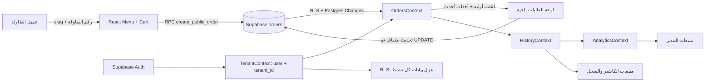

# دليل SERVIO التقني — فهم النسخة الأولى والاستعداد للنسخة الثانية

> هذا الدليل يشرح التطبيق كما هو في المستودع، لا كتصميم نظري فقط. أُضيفت تعليقات عربية مفصلة إلى مسارات الطلبات، وتهيئة المستأجر، والسجل والتحليلات. بقية المكونات مشروحة هنا بدل وضع تعليق على كل سطر؛ لأن التعليق الحرفي على كل سطر يزيد الضوضاء ويصعّب الصيانة.

## 1. SERVIO في جملة

SERVIO تطبيق ويب لإدارة طلبات الطاولات للمقاهي والمطاعم: يفتح العميل المنيو من رابط أو QR، يرسل الطلب، ثم يراه الكاشير/المدير ويحدّث حالته؛ وبعد اكتماله يدخل في سجل المبيعات والتحليلات.

**تقنيات النسخة الحالية:** React 19 وMaterial UI، Supabase Auth/Postgres/Realtime، وVercel لنشر واجهة الويب. الواجهة ثنائية اللغة في أغلب لوحات الإدارة وتدعم RTL عند العربية.

## 2. صورة ذهنية لتدفق البيانات



**قاعدة الاعتماد الأساسية:** لا تبدأ قراءة الطلبات قبل معرفة `tenant_id`. لذلك يأتي `TenantProvider` قبل `OrdersProvider`، ثم يأتي `HistoryProvider` و`AnalyticsProvider` بعدهما.

## 3. ترتيب مزودي الحالة ولماذا يهم

في `src/index.js` توضع مزودات React حول التطبيق. الترتيب ليس تجميليًا:

1. `LanguageProvider`: النصوص والاتجاه RTL/LTR.
2. `TenantProvider`: يحسم هل الصفحة عامة أم لوحة داخلية، ويعيد `tenantId` وملف النشاط.
3. `MenuProvider` و`CartProvider`: قائمة الطعام والسلة.
4. `OrdersProvider`: الطلبات، استعلام Supabase، قناة Realtime، الإضافة وتغيير الحالة.
5. `HistoryProvider`: يفصل الطلبات المكتملة والملغاة ويشارك حالة التحميل والخطأ.
6. `AnalyticsProvider`: يبني الأرقام والرسوم من بيانات السجل.
7. بقية المزودات: المتجر والمستخدم والطاولات والتقييمات ونداءات النادل والاقتراحات.

أي استدعاء لـ`useOrders()` داخل مزود يجب أن يكون داخل هذا الترتيب، وأي قراءة للوحة المدير لا يجوز أن تتجاوز حالة تحميل المستأجر.

## 4. خريطة الملفات الأساسية

| الملف/المجلد | المسؤولية | ما ينبغي فهمه قبل التعديل |
|---|---|---|
| `src/App.js` | تعريف المسارات العامة ولوحات الأدوار | `/menu/:slug/:tableNumber?` و`/:slug/:tableNumber?` للمنيو؛ `/dashboard` للكاشير؛ `/manager` للمدير. |
| `src/context/TenantContext.jsx` | حل slug العام أو جلسة المستخدم والملف والمستأجر | `tenantId` هو شرط قراءة البيانات وسياسات RLS. |
| `src/context/UserContext.jsx` | تجهيز هوية العرض من Supabase Auth وملف المستخدم | Auth يثبت الهوية؛ بيانات `profiles` توفر الدور والاسم. |
| `src/supabase.js` | إنشاء عميل Supabase وإعداد الاتصال | مفاتيح المتصفح لا تتضمن مطلقًا `service_role`. |
| `src/context/MenuContext.jsx` | تحميل الأصناف والفئات وتعديلها | RPCs عامة للمنيو، واستعلامات مقيدة بـ`tenant_id` في الإدارة. |
| `src/context/CartContext.jsx` | حفظ السلة المحلية قبل الإرسال | لا تجعل السلة مصدر إجمالي مبيعات موثوقًا؛ قاعدة البيانات هي المرجع بعد إنشاء الطلب. |
| `src/context/OrdersContext.jsx` | المصدر الأساسي للطلبات والـRealtime والإضافة وتغيير الحالة | اقرأ تعليقاته العربية؛ فيه مزامنة اللقطة الأولية مع التغييرات اللحظية والتراجع الآمن عن التحديث المتفائل. |
| `src/context/HistoryContext.jsx` | تصنيف سجل المكتمل/الملغى ونقل حالة التحميل | لا ينشئ استعلامًا موازيًا؛ يعيد استخدام `OrdersContext`. |
| `src/context/AnalyticsContext.jsx` | حساب مبيعات اليوم/الأسبوع/الساعات ومتوسط الطلب والأصناف | يحتسب الطلبات المكتملة غير الملغاة باستخدام `completed_at` مع رجوع للقديم. |
| `src/pages/CashierDashboard.jsx` | إجمالي اليوم وسجل الكاشير وقائمة الطلبات | يعرض شرطة عند عدم اكتمال التحميل كي لا يحوّل الخطأ إلى صفر. |
| `src/components/cashier-dashboard/orders/LiveOrders.jsx` | أعمدة الطلبات النشطة | البطاقة لا تعرض طلبًا ناقص الحقول؛ الرسالة توفر إعادة محاولة عند فشل القراءة. |
| `src/components/cashier-dashboard/orders/OrderItemCard.jsx` | عرض الطلب وزر انتقال الحالة والفاتورة | الواجهة تعرض تحديثًا متفائلًا؛ `OrdersContext` يؤكد الحفظ من قاعدة البيانات. |
| `src/components/manager-dashboard/Analytics/AnalyticsOverview.jsx` | بطاقات إجمالي اليوم ومتوسط الطلب والنمو | يستخدم `analyticsReady`، فلا يعرض أصفارًا أثناء التحميل أو الخطأ. |
| `src/components/manager-dashboard/orders/OrderPill.jsx` | الفاتورة القابلة للطباعة | تحتاج من كل صنف الاسم والكمية والسعر؛ لا تحتاج صورة المنيو. |
| `supabase/migrations/` | تطور مخطط قاعدة البيانات وسياساتها ودوالها | لا تعدّل ترحيلًا مطبقًا؛ أضف ترحيلًا جديدًا واحفظ ترتيب الإصدارات. |
| `public/index.html`, `public/manifest.json` | اسم الصفحة وأيقونة المتصفح وبيانات PWA | حافظ على اتساق الاسم واللون مع علامة SERVIO. |

## 5. مسارات الاستخدام خطوة بخطوة

### 5.1 طلب العميل من QR

1. رابط QR يفتح `/:slug/:tableNumber` (أو مسار `/menu/...`).
2. `TenantContext` يرى وجود `slug`، ثم يطلب `get_public_tenant` و`get_public_store`.
3. `MenuContext` يقرأ الفئات والأصناف عبر RPCs عامة مسموح بها للمنيو.
4. `CartContext` يجمع الأصناف والإضافات محليًا.
5. `OrdersContext.addOrder()` يختصر عناصر الطلب إلى `id`, `cartItemId`, `name`, `quantity`, `price`، ثم ينادي `create_public_order` مع slug الطاولة والإجمالي والملاحظات.
6. قاعدة البيانات تضع `tenant_id` من slug موثوق بدل الاعتماد على قيمة يرسلها المتصفح. كما يفرض الترحيل الجديد إزالة حقول الصور والوصف من `items` عند كل إدراج أو تحديث.
7. بعد وصول الطلب، تبثه Postgres Changes إلى مستأجره؛ تُضاف البطاقة ويُصدر صوت التنبيه مرة واحدة.

### 5.2 تحديث حالة الطلب

مسار الحالة في الواجهة:

```text
pending → preparing → ready → served
     └→ cancelled             └→ unclaimed
```

- `pending` و`preparing` و`ready` تظل في لوحة الطلبات النشطة.
- `served` و`unclaimed` حالات منتهية، وتدخل في المبيعات.
- `cancelled` يثبت في السجل لكنه لا يُحسب إيرادًا مكتملًا.
- عند الضغط، تعرض البطاقة الحالة الجديدة فورًا لتظل الواجهة سريعة، ثم تحفظ `status`, `is_completed`, `completed_at` في `orders`.
- إذا تعذر الاتصال مؤقتًا، تعاد المحاولة مرتين. عند فشل مؤكد ترجع الواجهة للحالة السابقة فقط إذا لم يصل حدث أحدث من جهاز آخر.
- وصول `UPDATE` عبر Realtime يوحّد الأجهزة المفتوحة على قاعدة البيانات؛ إجمالي المبيعات لا يعتمد على نجاح تحديث CSS أو حالة محلية.

### 5.3 حساب المبيعات

- `orders.total_price` هو قيمة الطلب المحفوظة عند الإنشاء، وهو مصدر جمع المبيعات.
- تستبعد `cancelled` دائمًا من إيراد المبيعات.
- يعتمد يوم البيع على `completed_at`، وعند غيابها في سجل قديم يستخدم `created_at`.
- متوسط الطلب = إجمالي مبيعات الطلبات المكتملة اليوم ÷ عددها.
- المنتجات الأعلى مبيعًا تُحسب من `name`, `quantity`, `price` في عناصر الطلب.
- تحميل البيانات أو فشله لا يعني مبيعات صفرًا: تعرض اللوحات `—`، ويعرض المدير/الكاشير إعادة محاولة حيث يلزم.

## 6. قواعد الأمان وSupabase للمطور

### 6.1 عزل الأنشطة

- كل صف خاص بنشاط يحمل `tenant_id`.
- المستخدم الداخلي يصل عبر جلسة Supabase، وRLS تفحص الملف/الدور/المستأجر في قاعدة البيانات.
- فلتر `.eq("tenant_id", tenantId)` في الواجهة يقلل النتائج ويحسن الوضوح، لكنه **ليس بديلًا** عن RLS.
- الـRPC العام مقصور على البيانات اللازمة للزائر ويأخذ `slug`، أما عمليات الإدارة فتتطلب الجلسة وسياسات الدور.

### 6.2 مفاتيح الاتصال

- يسمح في bundle المتصفح بمفتاح Supabase **anon/publishable** فقط لأن الحماية الفعلية هي RLS.
- لا تضع `service_role` أو مفاتيح Vercel السرية في React أو في مستودع Git.
- احتفظ بالقيم المحلية في `.env.local`؛ الملف مستثنى في `.gitignore`.
- في Vercel، عرّف متغيرات البيئة في إعدادات المشروع ثم أعد النشر؛ لا تسجل قيمها في وثيقة أو سجل CI.

### 6.3 مراجعة طلب جديد في Supabase

عند فشل قراءة أو كتابة:

1. افحص حالة جلسة المستخدم في `auth.users`/`supabase.auth.getSession()`، لا تطبع token.
2. تأكد أن `TenantContext.loading` انتهى وأن `tenantId` ليس `null`.
3. راجع RLS policies على الجدول والدور الحالي.
4. راجع أخطاء PostgREST وPostgres وRealtime، ثم قارن رقم الطلب ووقته دون مشاركة بيانات شخصية.
5. اختبر RPC من عميل غير مسجل ومستخدم من نشاط آخر؛ يجب ألا يرى أي طلب غير تابع له.

## 7. سبب المشاكل التي ظهرت وما عالجه هذا الإصدار

### 7.1 بطء وصول الطلب وفشل انتقال الحالة

في الإنتاج كانت **10 طلبات تحتوي على `image` كبيرة داخل كل عنصر**؛ حجم أكبر صف يقارب 1.51 MB، ومجموع عمود `items` قرابة 14 MB رغم وجود 31 طلبًا فقط. هذه الصور مكانها المنيو/التخزين، وليست داخل سجل الفاتورة. وكانت استعلامات قراءة الطلبات تسحب `items` كاملة، فتؤخر التهيئة وتضخم أحداث التحديث.

التنظيف السابق كان لمرة واحدة؛ لذلك أضاف بعض العملاء القدامى طلبات كبيرة بعده. المعالجة الجديدة من طبقتين:

1. **قبل الحفظ:** trigger في Postgres يزيل `image`, `tags`, `description`, `allergens` من عناصر كل `INSERT` و`UPDATE`، بما يشمل عملاء قدامى وRPC العام.
2. **للصفوف الموجودة:** يشغّل الترحيل نفسه التنظيف مرة واحدة، مع إبقاء بقية أعمدة الطلب.
3. **في الواجهة:** يعاد طلب اللقطة الأولية بعد نجاح الاشتراك أو إعادة الاتصال، وتُحفظ أحداث Realtime التي وصلت أثناء القراءة كي لا تطغى لقطة أقدم عليها.
4. **عند تغير الحالة:** تحديث متفائل مع طلب Supabase مؤكد ومحاولة ثانية للأخطاء المؤقتة فقط.

**ما لا نحذفه:** `id`, `cartItemId`, `name`, `quantity`, `price`, `total_price`, `status`, `completed_at`، ولا بيانات `menu_items` الأصلية. الفاتورة والتحليلات تحتاج الحقول المتبقية فقط.

### 7.2 ظهور المبيعات صفرًا بعد التحديث

كان `OrdersContext` يبدأ قراءة الطلبات قبل انتهاء حسم جلسة/مستأجر، وعند فشل الاستعلام ترجع التحليلات قائمة فارغة فتبدو كأن المبيعات صفر. الآن:

- الانتظار حتى اكتمال `TenantContext` قبل طلب الصفوف.
- إعادة محاولة قصيرة للأخطاء المؤقتة.
- حفظ خطأ التحميل وإظهار `—` بدلاً من `0` حتى لا يكون العرض مضللًا.
- زر إعادة محاولة على لوحة المدير والطلبات الحية.
- ترتيب حساب المبيعات حسب وقت الإكمال، مع fallback للطلبات القديمة.

### 7.3 خط أساس البيانات الذي استُخدم للتحقق

في قاعدة الإنتاج قبل التنظيف: 22 طلبًا `served` بإجمالي 484 ر.س، وطلب واحد `unclaimed` بإجمالي 12 ر.س، و5 `cancelled` بإجمالي 105 ر.س، و3 `pending` بإجمالي 70 ر.س. لذلك كان إجمالي المبيعات المكتملة غير الملغاة لليوم **496 ر.س**، وليس 671 أو 0. بعد تطبيق ترحيل التنظيف يجب أن تبقى هذه المجاميع نفسها.

> الأرقام أعلاه تخص لقطة التحقق يوم 2026-10-03 وليست تقريرًا دائمًا أو بديلًا عن دفتر محاسبي.

### 7.4 مزامنة تبويب المنيو في لوحة المدير

كانت `MenuProvider` تجلب الأصناف مرة عند تغير النشاط/المسار فقط، ولا تعيد الجلب عند فتح تبويب المنيو؛ كما أن جدولي `menu_items` و`categories` غير مضافين لقناة Postgres Changes. لذلك قد ينجح الحفظ من جهاز، بينما تظل لوحة مدير أخرى على لقطة قديمة.

الحل يستخدم قناة Broadcast خاصة باسم `tenant:<tenant_id>:menu_catalog`: محفزات الإدراج/التعديل/الحذف ترسل اسم الجدول ومعرف الصف والعملية فقط، وتعيد الواجهة جلب بيانات النشاط عبر RLS. تمنح سياسة `realtime.messages` القراءة المسجلة فقط إذا طابق topic نشاط المستخدم الحالي. لا تُرسل صور المنيو (بعضها مخزن كـBase64 بحجم يقارب 1.5 MB)، ولا يُفتح بث عام. كما يعاد الجلب عند فتح تبويب المدير أو عودة الشبكة/الصفحة للواجهة؛ وعند فشل الجلب يحتفظ السياق بآخر بيانات سليمة ويظهر زر إعادة المحاولة.

## 8. هوية التطبيق والاقتراحات البصرية

الاسم المعتمد في الواجهة: **SERVIO**. اللونان الأساسيان الحاليان: كحلي `#171A2F` وبرتقالي `#F47920`. الاتجاه الأحدث الذي طُبق على التطبيق موثق في [`SERVIO_BRAND_DIRECTIONS_AR.md`](SERVIO_BRAND_DIRECTIONS_AR.md)؛ والأفكار أدناه هي تصورات المرحلة السابقة.

### الاتجاه أ — طبق وبخار على هيئة S


مناسب لعلامة أكثر دفئًا للمقاهي والمطاعم؛ بسيط لكن عنصر البخار قد يبدو كعلامة طعام عامة عند تصغيره.

### الاتجاه ب — إيصال طلب وعلامة اعتماد (المستخدم حاليًا لأيقونة المتصفح)


**الاختيار الحالي:** يشرح الطلب والخدمة بسرعة، ويميز البرتقالي على خلفية كحلية. مناسب لـfavicon وPWA؛ يمكن تطويره لاحقًا إلى wordmark عربي/إنجليزي.

### الاتجاه ج — طبق وإطار زوايا QR


يوضح طلب الطاولة بالـQR، وهو تقني أكثر، لكنه أقل تميّزًا لخدمات إدارة المطاعم عمومًا.

اقتراح قبل اعتماد شعار تسويقي كامل: اختبر العلامة بالأحجام 16/32/192/512 px، وبالأبيض والأسود، ثم اختبرها بجوار كتابة `SERVIO` على الهيدر والفاتورة. الصور الحالية مفاهيم أولية وليست ملف هوية نهائيًا أو wordmark مرخصًا.

## 9. كيف تشغّل المشروع وتتحقق من التغيير

```bash
npm ci
npm start
```

البناء الإنتاجي:

```bash
npm run build
```

الاختبارات (إن وُجدت):

```bash
npm test -- --watchAll=false
```

### سيناريو اختبار يدوي قبل الإصدار

1. سجل دخول مستخدم الكاشير وانتظر اختفاء التحميل الأولي.
2. افتح صفحة المنيو من QR/رابط slug في متصفح آخر وأرسل طلبًا بعناصر فيها صور كبيرة في المنيو.
3. تأكد أن الكاشير يراه دون تحديث الصفحة، وأن صف `orders.items` لا يحتوي مفاتيح الصور/الوصف وأن الحجم صغير.
4. حوّل `pending → preparing → ready → served` وتأكد من الجهاز الثاني ومن `completed_at`.
5. حدّث صفحة المدير والكاشير؛ يجب أن يبقى إجمالي اليوم مطابقًا لـ`SUM(total_price)` للطلبات المكتملة غير الملغاة.
6. جرّب `cancelled` وتأكد أنه لا يدخل المبيعات، وأنه يظهر في السجل وفق سلوك شاشة السجل الحالية.
7. اختبر انقطاعًا مؤقتًا في الشبكة: يظهر `—` أو رسالة الخطأ وزر إعادة المحاولة، ولا يظهر صفر باعتباره قيمة مؤكدة.
8. اختبر مستخدم نشاط ثانٍ: لا يرى الطلب الأول ولا يسمع إشعاره.

**استعلام تحقق آمن بعد الترحيل** (يقرأ المعرّف والحجم فقط):

```sql
SELECT id, octet_length(items::text) AS items_bytes
FROM public.orders
ORDER BY octet_length(items::text) DESC
LIMIT 20;
```

للتأكد من غياب الصور القديمة:

```sql
SELECT count(*) AS orders_still_with_image
FROM public.orders AS o
WHERE jsonb_typeof(o.items) = 'array'
  AND EXISTS (
    SELECT 1
    FROM jsonb_array_elements(o.items) AS entry(item)
    WHERE jsonb_typeof(entry.item) = 'object' AND entry.item ? 'image'
  )
LIMIT 1;
```

## 10. سياسة الترحيلات قبل النسخة الثانية

1. كل تغيير قاعدة بيانات جديد له ملف migration مستقل واسم يصف النتيجة.
2. لا تعدّل ملف migration سبق تطبيقه في الإنتاج؛ أضف ملفًا جديدًا.
3. جرّب الترحيل على بيئة تطوير/نسخة احتياطية أولًا إذا غيّر بيانات، وأضف `WHERE` يحدد الصفوف المقصودة.
4. طبّق DDL ثم تحقق من trigger/RLS/Realtime، ثم راجع سجل الترحيلات.
5. **انتبه لاختلاف رقم الإصدار:** قاعدة الإنتاج سجّلت `harden_orders_realtime_v2` تحت `20261003094102`، وضغط الطلبات تحت `20261003105039`، وبث المنيو الخاص تحت `20261003111547`؛ لكن بعض ملفات المستودع الأقدم ما زالت تستخدم طوابع أحدث `20261003120000` إلى `20261003124000` وأسماء/إصدارات لا تطابق السجل. طابق `supabase_migrations.schema_migrations` مع الملفات قبل `supabase db push`؛ لا تشغّل دفعًا جماعيًا أعمى لأن CLI قد يعيد تنفيذ ترحيلات قديمة غير مسجلة.
6. الملف المطابق لترحيل ضغط الطلبات هو `supabase/migrations/20261003105039_compact_order_payload_server_guard.sql`، وترحيل مزامنة المنيو هو `supabase/migrations/20261003111547_sync_menu_catalog_realtime.sql`.

## 11. خطة تطوير مقترحة للنسخة الثانية

بالترتيب الذي يقلل مخاطر تعديل الأجزاء العاملة:

1. **اختبارات آلية لمسار الطلب:** إنشاء RPC، عزل المستأجر، الحالات، احتساب المبيعات، والأخطاء/إعادة الاتصال.
2. **أنواع قاعدة بيانات مولدة:** توليد TypeScript types من Supabase ثم كتابة حدود API typed بدل `select("*")` في contexts الأخرى.
3. **مخطط أصناف تاريخي واضح:** إذا توسع المنتج، انقل عناصر الطلب من JSONB إلى `order_items` مرتبط بالطلب، مع snapshot للاسم والسعر وقت الشراء؛ لا تنفذ ذلك قبل خطة ترحيل ونسخ احتياطي.
4. **صور المنيو:** حفظ الصور في Supabase Storage وروابطها على `menu_items`، لا base64 في JSON الطلب أو في event payload.
5. **قابلية الرصد:** قياس زمن الاستعلام والـRealtime، ومعدل إعادة المحاولة، ومصدر الخلل دون تسجيل بيانات عميل/مفاتيح.
6. **إدارة الترحيلات:** بيئة staging وخط نشر واضح، وربط كل migration باسم وإصدار منضبطين.
7. **صلاحيات متعددة الأدوار:** اختبارات دورية لـRLS وRPCs عند إضافة مدير/كاشير/مالك نشاط.
8. **سجل تغييرات الطلب:** إذا احتاج العمل معرفة من غيّر الحالة ومتى، أضف audit log مستقلًا بدل الاعتماد على حالة الطلب الحالية وحدها.

## 12. مصطلحات مختصرة

| المصطلح | المعنى في SERVIO |
|---|---|
| Tenant / مستأجر | النشاط التجاري المستقل داخل التطبيق. |
| `tenant_id` | مفتاح يربط الصف بنشاط واحد ويُستخدم في سياسات العزل. |
| RLS | سياسة صفوف في Postgres تمنع المستخدم من رؤية بيانات خارج نشاطه. |
| RPC | دالة قاعدة بيانات يمكن استدعاؤها عبر PostgREST/Supabase؛ تستخدم للعمليات العامة المضبوطة. |
| Realtime | مزامنة بيانات بين الأجهزة. الطلبات تستخدم Postgres Changes؛ أما المنيو فيستخدم Broadcast خاصًا للمستأجر بحمولة صغيرة وسياسة RLS على `realtime.messages`. |
| Optimistic update | إظهار التغيير فورًا في الواجهة ثم تصديقه من قاعدة البيانات أو التراجع عنه عند الفشل. |
| Snapshot | قراءة REST الحالية للطلبات؛ تُجمع مع الأحداث اللحظية كي لا تضيع تغييرات وقعت أثناء القراءة. |
| `completed_at` | وقت انتهاء الطلب المستخدم لتجميع مبيعات اليوم. |
| `items` | تفاصيل الأصناف كـJSONB؛ يجب أن تحمل snapshot السعر والاسم والكمية، لا صور المنيو الكبيرة. |

## 13. شاشة نقطة البيع للكاشير

تُفتح من زر **واجهة الكاشير** المجاور لزر درج سجل الطلبات في لوحة `/dashboard`. المسار `/dashboard/pos` محميّ بـ`RequireSession role="cashier"`. تستخدم الشاشة أصناف النشاط الحالي المتاحة من `MenuContext`، وتحتفظ بسلة محلية قابلة لتعديل الكميات، ثم تحفظ عبر `OrdersContext.addOrder` بالحالة `pending`؛ لذلك تدخل الطابور الحي للمطبخ عبر تدفق الطلبات الحالي، ولا تُحسب مبيعات مكتملة قبل إنهاء الحالات.

الفاتورة المستخدمة واحدة بين شاشة POS وسجل الكاشير وسجل المدير: `src/components/manager-dashboard/orders/OrderPill.jsx`. وتفاصيل الشاشة والحالات والاختبار موجودة في [`CASHIER_POS_VAT_AR.md`](CASHIER_POS_VAT_AR.md).

## 14. ضريبة القيمة المضافة على الفواتير

أكد المستخدم أن أسعار المنيو المسجلة نهائية وشاملة VAT؛ لذا يعرض النظام المبلغ قبل الضريبة والضريبة المضمنة مع الحفاظ على إجمالي العميل. المعدل القياسي في المملكة **15%**. استخراج VAT من إجمالي شامل يستخدم `gross × 15/115` بعد التقريب إلى هللة، وليس إضافة 15% فوق سعر شامل:

```text
مثال 115.00 ر.س: أساس قبل الضريبة 100.00 + VAT 15.00 = الإجمالي 115.00
```

الدالة المشتركة واختباراتها في `src/utils/taxUtils.js` و`src/utils/taxUtils.test.js`. لا تضيف الشاشة migration: تخزن `orders.total_price` الإجمالي النهائي نفسه، وتستخرج التفصيل عند العرض. إذا تغير المعدل مستقبلًا، يجب أن يسبق ذلك تخزين snapshot للمعاملة حتى لا تتغير الفواتير التاريخية عند إعادة فتحها.

> الطباعة الحالية إيصال مبسط مع تفصيل VAT، وليست تكاملًا مع منصة «فاتورة» أو ضمانًا للامتثال الكامل للفوترة الإلكترونية. راجع [`SOURCES_CASHIER_VAT_AR.md`](SOURCES_CASHIER_VAT_AR.md) و[`CASHIER_POS_VAT_AR.md`](CASHIER_POS_VAT_AR.md) لتفاصيل النطاق والمصادر الرسمية وحدود الاستخدام.

## 15. فحوص ميزة الكاشير الجديدة

```bash
npm test -- --watchAll=false --runInBand
npm run build
```

جرّب من معاينة النشر أن المستخدم غير الكاشير لا يدخل `/dashboard/pos`، وأن طلبًا من POS يظهر `pending` في شاشة المطبخ، وأن فاتورة مبلغها 115 تعرض 100 قبل VAT و15 VAT و115 مستحقًا. اختبر كذلك تعديل السلة والطباعة والاتجاهين العربي والإنجليزي، وأعد فتح فاتورة من سجل المدير وسجل الكاشير للتأكد من استخدام المكون المشترك.
